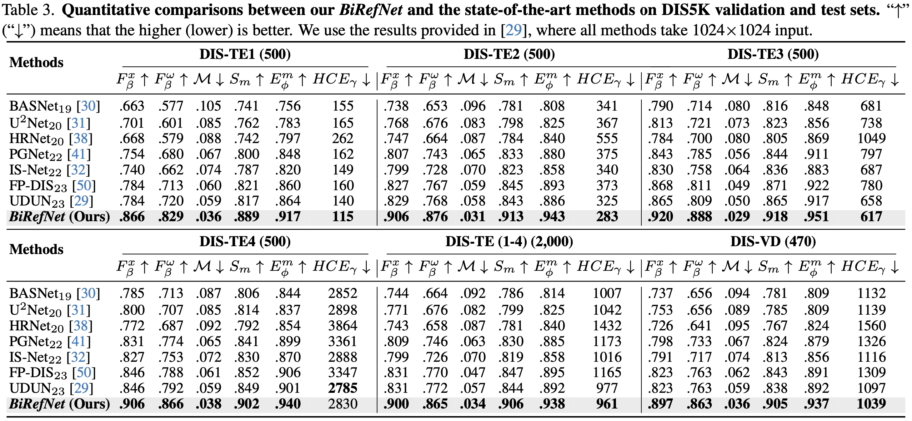
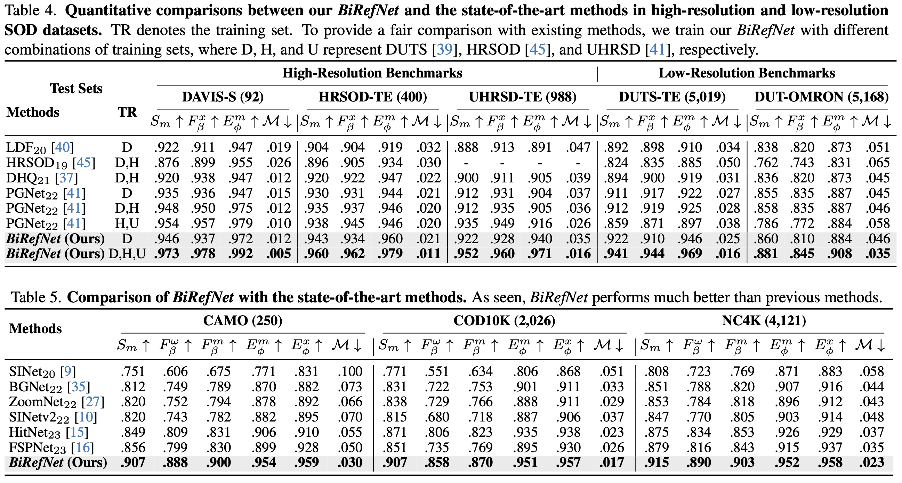
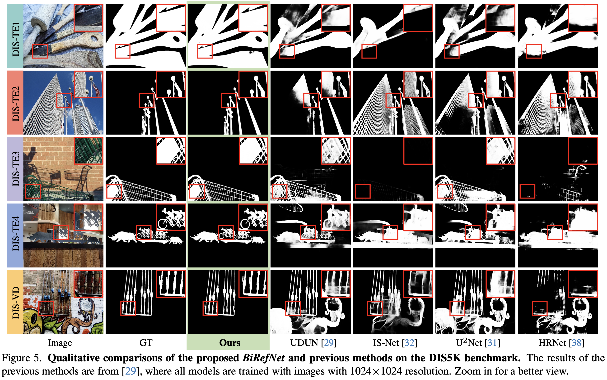
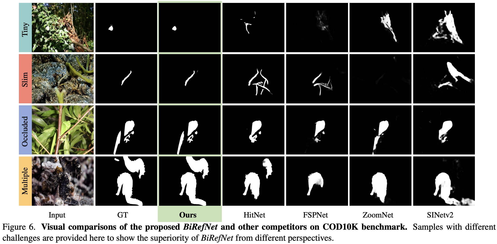

# <p align=center>`Bilateral Reference for High-Resolution Dichotomous Image Segmentation`</p>

This repo is the official implementation of "[**Bilateral Reference for High-Resolution Dichotomous Image Segmentation**](https://arxiv.org/pdf/2401.03407.pdf)" (___arXiv 2024___).

> **Authors:**
> [Peng Zheng](https://scholar.google.com/citations?user=TZRzWOsAAAAJ),
> [Dehong Gao](https://scholar.google.com/citations?user=0uPb8MMAAAAJ),
> [Deng-Ping Fan](https://scholar.google.com/citations?user=kakwJ5QAAAAJ),
> [Li Liu](https://scholar.google.com/citations?user=9cMQrVsAAAAJ),
> [Jorma Laaksonen](https://scholar.google.com/citations?user=qQP6WXIAAAAJ),
> [Wanli Ouyang](https://scholar.google.com/citations?user=pw_0Z_UAAAAJ), &
> [Nicu Sebe](https://scholar.google.com/citations?user=stFCYOAAAAAJ).

[[**arXiv**](https://arxiv.org/abs/2401.03407)] [[**code**](https://github.com/ZhengPeng7/BiRefNet)] [[**stuff**](https://drive.google.com/drive/u/0/folders/1s2Xe0cjq-2ctnJBR24563yMSCOu4CcxM)] 

#### Try our online demos for inference:

+ **Inference and evaluation** of your given weights: [](https://colab.research.google.com/drive/1MaEiBfJ4xIaZZn0DqKrhydHB8X97hNXl#scrollTo=DJ4meUYjia6S)
+ **Online Inference with GUI** with adjustable resolutions: [](https://huggingface.co/spaces/ZhengPeng7/BiRefNet_demo).

Our BiRefNet has achieved SOTA on many similar HR tasks:

 **DIS**: [](https://paperswithcode.com/sota/dichotomous-image-segmentation-on-dis-te1?p=bilateral-reference-for-high-resolution) [](https://paperswithcode.com/sota/dichotomous-image-segmentation-on-dis-te2?p=bilateral-reference-for-high-resolution) [](https://paperswithcode.com/sota/dichotomous-image-segmentation-on-dis-te3?p=bilateral-reference-for-high-resolution) [](https://paperswithcode.com/sota/dichotomous-image-segmentation-on-dis-te4?p=bilateral-reference-for-high-resolution) [](https://paperswithcode.com/sota/dichotomous-image-segmentation-on-dis-vd?p=bilateral-reference-for-high-resolution)

**COD**:[](https://paperswithcode.com/sota/camouflaged-object-segmentation-on-cod?p=bilateral-reference-for-high-resolution) [](https://paperswithcode.com/sota/camouflaged-object-segmentation-on-nc4k?p=bilateral-reference-for-high-resolution) [](https://paperswithcode.com/sota/camouflaged-object-segmentation-on-camo?p=bilateral-reference-for-high-resolution) [](https://paperswithcode.com/sota/camouflaged-object-segmentation-on-chameleon?p=bilateral-reference-for-high-resolution)

**HRSOD**: [](https://paperswithcode.com/sota/rgb-salient-object-detection-on-davis-s?p=bilateral-reference-for-high-resolution) [](https://paperswithcode.com/sota/rgb-salient-object-detection-on-hrsod?p=bilateral-reference-for-high-resolution) [](https://paperswithcode.com/sota/rgb-salient-object-detection-on-uhrsd?p=bilateral-reference-for-high-resolution) [](https://paperswithcode.com/sota/salient-object-detection-on-duts-te?p=bilateral-reference-for-high-resolution) [](https://paperswithcode.com/sota/salient-object-detection-on-dut-omron?p=bilateral-reference-for-high-resolution)


## Usage

#### Environment Setup

```shell
# PyTorch==2.0.1 is used for faster training with compilation.
conda create -n dis python=3.9 -y && conda activate dis
pip install -r requirements.txt
```

#### Dataset Preparation

Download datasets for *DIS*, *COD*, *HRSOD* from [my google-drive folder](https://drive.google.com/drive/u/0/folders/1s2Xe0cjq-2ctnJBR24563yMSCOu4CcxM) or their official pages.

#### Weights Preparation

Download backbone weights from [my google-drive folder](https://drive.google.com/drive/u/0/folders/1s2Xe0cjq-2ctnJBR24563yMSCOu4CcxM) or their official pages.

#### Run

```shell
# Train & Test & Evaluation
./sub.sh RUN_NAME GPU_NUMBERS_FOR_TRAINING GPU_NUMBERS_FOR_TEST
# See train.sh / test.sh for only training / test-evaluation.
```

#### Well-trained weights:

Download the `BiRefNet_*.pth` from [[**stuff**](https://drive.google.com/drive/u/0/folders/1s2Xe0cjq-2ctnJBR24563yMSCOu4CcxM)].

The results might be a bit different from those in the original paper, you can see them in cells' outputs in the colab above. Due to the very high cost I used (A100-80G x 8) which many people cannot afford to (including myself....),  I re-trained BiRefNet on a single A100-40G only and achieve the performance on the same level. It means you can directly train the model on a single GPU with 35G+ memory.

But if you have more and more powerful GPUs, you can set GPU IDs and increase the batch size in `config.py` to accelerate the training. We have made all this kind of things adaptive in scripts to seamlessly switch between single-card training and multi-card training. Enjoy it :)


### Quantitative Results






### Qualitative Results






### Citation

```
@article{zheng2024birefnet,
  title={Bilateral Reference for High-Resolution Dichotomous Image Segmentation},
  author={Zheng, Peng and Gao, Dehong and Fan, Deng-Ping and Liu, Li and Laaksonen, Jorma and Ouyang, Wanli and Sebe, Nicu},
  journal={arXiv},
  year={2024}
}
```


## Contact

Any question, discussion or even complaint, feel free to leave issues here or send me e-mails (zhengpeng0108@gmail.com).
