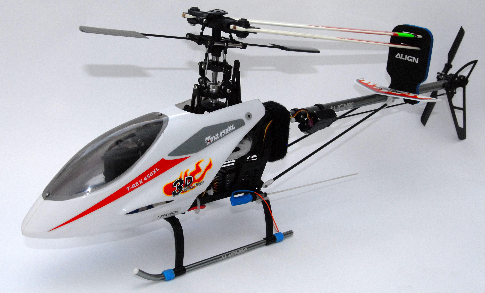
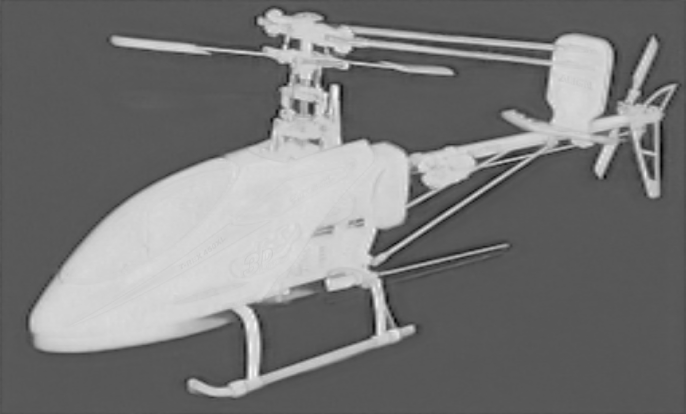
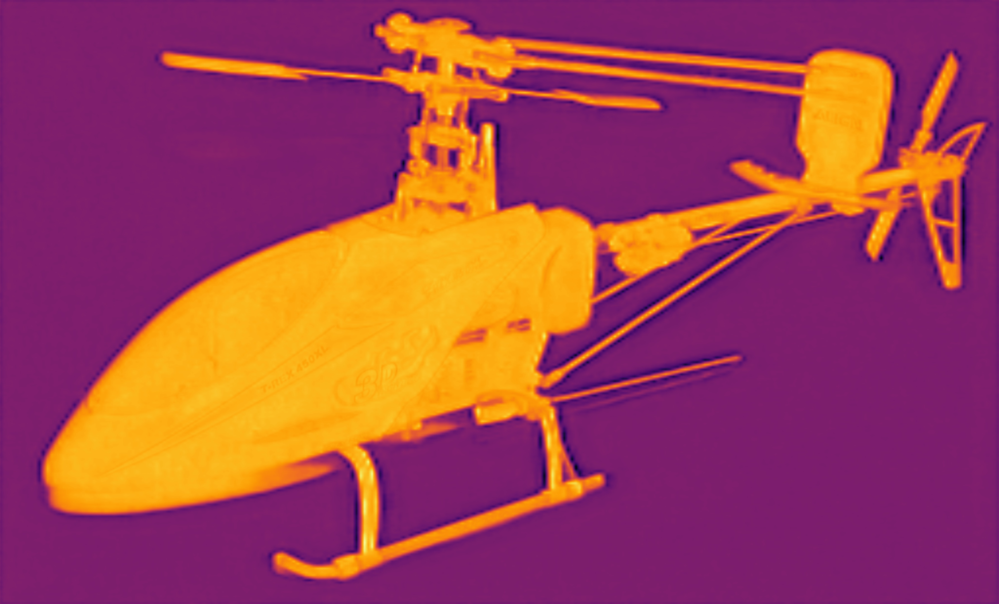

<div align="left">

BiRefNet TensorRT
===========================

[](https://www.python.org/downloads/release/python-31012/)
[](https://developer.nvidia.com/cuda-downloads)
[](https://developer.nvidia.com/tensorrt)
[](https://github.com/ZhengPeng7/BiRefNet/blob/65a831a76e0d94a285eba3c000837c2084ec154e/LICENSE#L2)

</div>

The cpp inference of BiRefNet based on Tensorrt. 

<p align="center">
  source
  
</p>
<p align="center">
  DichotomousImage-Gray
  
</p>
<p align="center">
  DichotomousImage-Pseudo
  
</p>

## Records
* **2024-08-27:** Add BiRefNet TensorRT Version.
  
## ⏱️ Performance

The inference time includes the pre-preprocessing and post-processing stages:
| Device          | Model | Model Input (WxH) |  Image Resolution (WxH)|Inference Time(ms)|
|:---------------:|:------------:|:------------:|:------------:|:------------:|
| RTX3080        | BiRefNet-general-bb_swin_v1_tiny-epoch_232.pth  |1024x1024  |  1024x1024    | 130     |


## 🛠️ C++相关库安装

1. Install TensorRT using TensorRT official guidance.

    <details>
    <summary>Click here for Windows guide</summary>     
   
    1. Download the [TensorRT](https://developer.nvidia.com/tensorrt) zip file that matches the Windows version you are using.
    2. Choose where you want to install TensorRT. The zip file will install everything into a subdirectory called `TensorRT-10.x.x.x`. This new subdirectory will be referred to as `<installpath>` in the steps below.
    3. Unzip the `TensorRT-10.x.x.x.Windows10.x86_64.cuda-x.x.zip` file to the location that you chose. Where:
    - `10.x.x.x` is your TensorRT version
    - `cuda-x.x` is CUDA version `12.4`, `11.8` or `12.0`
    4. Add the TensorRT library files to your system `PATH`. To do so, copy the DLL files from `<installpath>/lib` to your CUDA installation directory, for example, `C:\Program Files\NVIDIA GPU Computing Toolkit\CUDA\vX.Y\bin`, where `vX.Y` is your CUDA version. The CUDA installer should have already added the CUDA path to your system PATH.
   
    </details>

    [Click here for installing tensorrt on Linux](https://github.com/wang-xinyu/tensorrtx/blob/master/tutorials/install.md). 

2. Download and install any recent [OpenCV](https://opencv.org/releases/) for Windows. 
3. Modify TensorRT and OpenCV paths in CMakelists.txt:
   ```
   # Find and include OpenCV
   set(OpenCV_DIR "your path to OpenCV")
   find_package(OpenCV REQUIRED)
   include_directories(${OpenCV_INCLUDE_DIRS})
   
   # Set TensorRT path if not set in environment variables
   set(TENSORRT_DIR "your path to TensorRT")
   ```
  
4. Build project by using the following commands or  **cmake-gui**(Windows).

    1. Windows:
    ```bash
     mkdir build
    cd build
    cmake ..
    cmake --build . --config Release
    ```

    2. Linux(not tested):
    ```bash
    mkdir build
    cd build && mkdir out_dir
    cmake ..
    make
    ```

5. Finally, copy the opencv dll files such as `opencv_world490.dll` and `opencv_videoio_ffmpeg490_64.dll` into the `<BiRefNet_install_path>/build/Release` folder.


## 🤖 Model Preparation
Perform the following steps to create an onnx model:

1. Download the pretrained [model](https://github.com/ZhengPeng7/BiRefNet/releases/download/v1/BiRefNet-general-bb_swin_v1_tiny-epoch_232.pth) and install[BiRefNet](https://github.com/ZhengPeng7/BiRefNet):
   ``` shell
   git clone https://github.com/ZhengPeng7/BiRefNet.git
   cd BiRefNet
   
   # create a new conda enviroment
   conda create -n BiRefNet python=3.8
   conda activate BiRefNet
   pip install torch torchvision
   pip install opencv-python
   pip install onnx
   
   pip install -r requirements.txt
   
   # copy model and converted files on the root path of BiRefNet
   cp path_to_BiRefNet-general-bb_swin_v1_tiny-epoch_232.pth . 
   cp cpp/py pth2onnx.py .
   cp cpp/py deform_conv2d_onnx_exporter.py .
   ```

2. Export the model to onnx format using  [pth2onnx.py](https://github.com/spacewalk01/BiRefNet/blob/main/export.py).
    
    ``` shell
   python pth2onnx.py
    ```

> [!TIP]
> You can modify the size of input and output images, such as 512*512.

## 🚀 Quick Start
#### C++

- **Usage 1**: Create an engine from an onnx model and save it:
``` shell
trtexec --onnx=BiRefNet-general-bb_swin_v1_tiny-epoch_232.onnx --saveEngine=BiRefNet-general-bb_swin_v1_tiny-epoch_232.engine
```

> [!NOTE]
> If you want to accelerate the inference, you could add **fp16** while quantifying the model.

- **Usage 2**: Deserialize an engine. Once you've built your engine, the next time you run it, simply use your engine file:
``` shell
BiRefNet.exe <engine> <input image or video>
```

Example:
``` shell
# infer image
BiRefNet.exe BiRefNet-general-bb_swin_v1_tiny-epoch_232.engine.engine test.jpg
# infer folder(images)
BiRefNet.exe BiRefNet-general-bb_swin_v1_tiny-epoch_232.engine.engine data
# infer video
BiRefNet.exe BiRefNet-general-bb_swin_v1_tiny-epoch_232.engine.engine test.mp4 
```

## 👏 Acknowledgement

This project is based on the following projects:
- [Depth-Anything](https://github.com/LiheYoung/Depth-Anything) - Unleashing the Power of Large-Scale Unlabeled Data.
- [TensorRT](https://github.com/NVIDIA/TensorRT/tree/release/8.6/samples) - TensorRT samples and api documentation.
