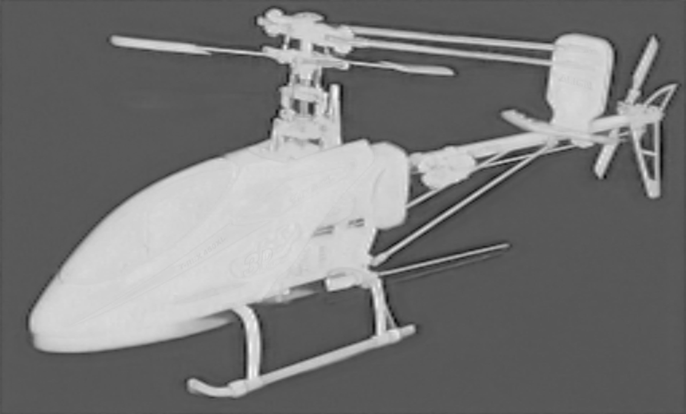

<div align="left">

BiRefNet TensorRT
===========================

[](https://www.python.org/downloads/release/python-31012/)
[](https://developer.nvidia.com/cuda-downloads)
[](https://developer.nvidia.com/tensorrt)
[](https://github.com/ZhengPeng7/BiRefNet/blob/65a831a76e0d94a285eba3c000837c2084ec154e/LICENSE#L2)

</div>

BiRefNet网络推理模型tensorrt(cpp)的实现.

<p align="center">
  原图
  
</p>
<p align="center">
  二分灰度图
  
</p>
<p align="center">
  二分伪彩色图
  
</p>

## 记录
* **2024-08-27:** 添加BiRefNet TensorRT版本.
  
## ⏱️ 推理性能

包含前、后处理阶段的推理时间:
| Device          | Model | Model Input (WxH) |  Image Resolution (WxH)|Inference Time(ms)|
|:---------------:|:------------:|:------------:|:------------:|:------------:|
| RTX3080        | BiRefNet-general-bb_swin_v1_tiny-epoch_232.pth  |1024x1024  |  1024x1024    | 130     |


## 🛠️ C++相关库安装

1. 根据TensorRT官方指南安装TensorRT.

    <details>
    <summary>点击查看Windows指南</summary>     
   
    1. 下载与你的Windows版本匹配的[TensorRT](https://developer.nvidia.com/tensorrt)压缩包,TensorRT版本要大于10.0.
    2. 选择你想要安装TensorRT的路径。压缩包将会解压到一个名为 TensorRT-10.x.x.x 的子目录中。以下步骤中，该目录将被称为 <installpath>.
    3. 将 TensorRT-10.x.x.x.Windows10.x86_64.cuda-x.x.zip 文件解压到你选择的位置。 其中:
    - `10.x.x.x` 是你的TensorRT版本
    - `cuda-x.x` 是CUDA版本，比如 `12.4`, `11.8` 或 `12.0`
    4. 将TensorRT库文件添加到系统的 PATH 中。为此，将 <installpath>/lib 目录下的DLL文件复制到你的CUDA安装目录中，例如 C:\Program Files\NVIDIA GPU Computing Toolkit\CUDA\vX.Y\bin，其中 vX.Y 是你的CUDA版本。CUDA安装程序应已将CUDA路径添加到你的系统PATH中.
   
    </details>

    [点击这里查看Linux上安装TensorRT的指南。](https://github.com/wang-xinyu/tensorrtx/blob/master/tutorials/install.md). 

2. 下载并安装任何最新版本的 [OpenCV](https://opencv.org/releases/). 
3. 在CMakelists.txt文件中修改TensorRT和OpenCV的路径:
   ```
   # Find and include OpenCV
   set(OpenCV_DIR "your path to OpenCV")
   find_package(OpenCV REQUIRED)
   include_directories(${OpenCV_INCLUDE_DIRS})
   
   # Set TensorRT path if not set in environment variables
   set(TENSORRT_DIR "your path to TensorRT")
   ```
  
4. 使用以下命令或cmake-gui(Windows)构建项目.

    1. Windows:
    ```bash
     mkdir build
    cd build
    cmake ..
    cmake --build . --config Release
    ```

    2. Linux(not tested):
    ```bash
    mkdir build
    cd build && mkdir out_dir
    cmake ..
    make
    ```

5. 最后，将 opencv_world490.dll 和 opencv_videoio_ffmpeg490_64.dll 等OpenCV DLL文件复制/软连接到 <BiRefNet_install_path>/build/Release 文件夹中.


## 🤖 模型准备
根据下面的步骤生成onnx文件:

1. 下载预训练 [模型](https://github.com/ZhengPeng7/BiRefNet/releases/download/v1/BiRefNet-general-bb_swin_v1_tiny-epoch_232.pth) 并安装 [BiRefNet](https://github.com/ZhengPeng7/BiRefNet):
   ``` shell
   git clone https://github.com/ZhengPeng7/BiRefNet.git
   cd BiRefNet
   
   # 可以新建一个新的anaconda环境
   conda create -n BiRefNet python=3.8
   conda activate BiRefNet
   pip install torch torchvision
   pip install opencv-python
   pip install onnx
   
   pip install -r requirements.txt
   
   # 将模型和转换代码拷贝到BiRefNet根目录下
   cp path_to_BiRefNet-general-bb_swin_v1_tiny-epoch_232.pth . 
   cp cpp/py pth2onnx.py .
   cp cpp/py deform_conv2d_onnx_exporter.py .
   ```

2. 通过 [pth2onnx.py](https://github.com/spacewalk01/BiRefNet/blob/main/export.py)导出onnx文件. 

    ``` shell
    python pth2onnx.py
    ```

> [!TIP]
> 可以在pth2onnx中自定义onnx的输入输出尺度，如512*512.

## 🚀 快速开始
#### C++

- **阶段 1**: 通过trtexec创建推理engine,经测试tensorrt的版本不小于10.0
``` shell
trtexec --onnx=BiRefNet-general-bb_swin_v1_tiny-epoch_232.onnx --saveEngine=BiRefNet-general-bb_swin_v1_tiny-epoch_232.engine
```

> [!NOTE]
> 此处使用的FP32默认的engine精度推理，如需加速的可以在考虑在转换的时候添加**fp16**进行半精度浮点数的量化.

- **阶段 2**: 反序列化engine进行推理
``` shell
BiRefNet.exe <engine> <input image or video>
```

推理例子:
``` shell
# 单图
BiRefNet.exe BiRefNet-general-bb_swin_v1_tiny-epoch_232.engine.engine test.jpg
# 文件夹
BiRefNet.exe BiRefNet-general-bb_swin_v1_tiny-epoch_232.engine.engine data
# 视频
BiRefNet.exe BiRefNet-general-bb_swin_v1_tiny-epoch_232.engine.engine test.mp4 
```

## 👏 Acknowledgement

在此鸣谢以下项目:
- [depth-anything-tensorrt](https://github.com/spacewalk01/depth-anything-tensorrt) - tensorrt迁移代码.
- [TensorRT](https://github.com/NVIDIA/TensorRT/tree/release/10.3/samples) - TensorRT 样例和api文档.
